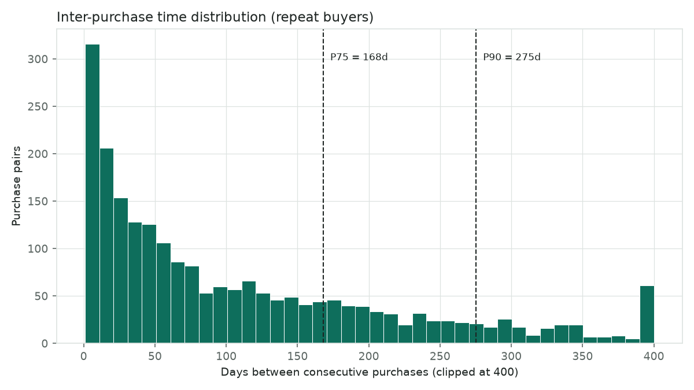
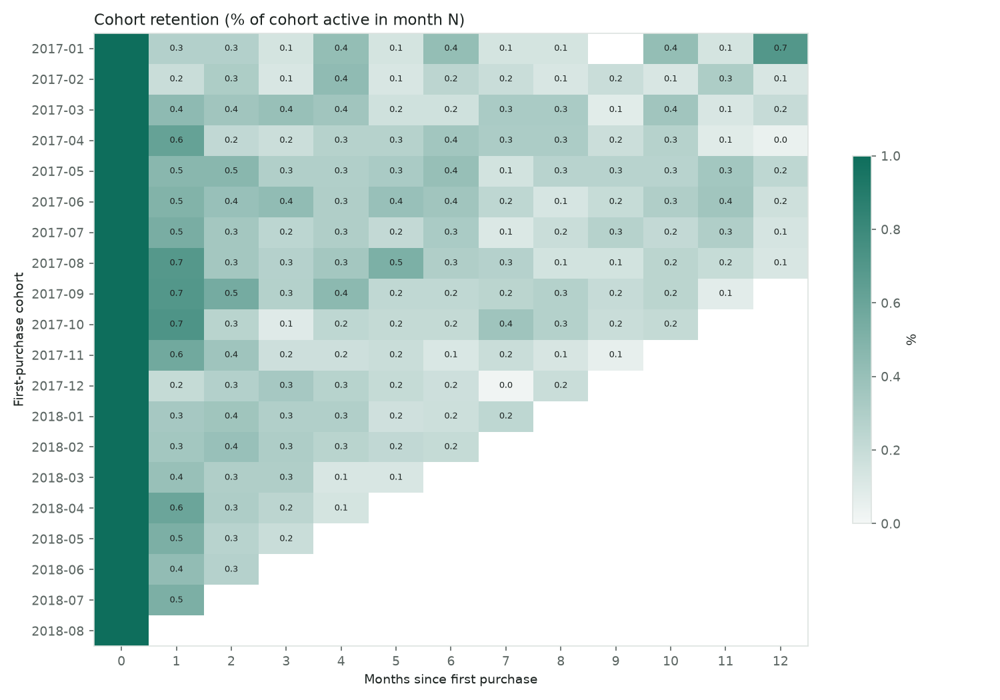

# Olist 會員流失 Cohort 分析報告

> 產生：2026-07-20 19:11 · pipeline 自動輸出，數字口徑見 DATA_NOTES.md
> 商業假設（可在 src/params.py 調整後重跑）：毛利率 30%、
> 券面額 10%、領券率 20%

## TL;DR — 給主管的三個決策建議

| # | 決策 | 依據 |
|---|------|------|
| 1 | **流失定義定為 275 天未回購**（回購預警線 168 天） | 回購者間隔分布 P90／P75（n=2219 組回購對） |
| 2 | **挽回名單 22,699 人**（處於預警帶），依價值分四級 | RFM 分層，見下表 |
| 3 | **發券決策：見各價值層判定**——損益兩平需要 uplift ≥ 6.67pp | break-even 分析＋敏感度表 |

**一個要先講的事實**：本平台窗口內回購客僅 3.0%。這不是經營失敗——
Olist 是低頻 marketplace，正確的 KPI 是回購週期與 90 天回購率，
不是月留存（詳見附錄「方法與限制」）。

## Q1 · 客人多久回來一次？

回購間隔中位數 69 天、P75 = 168 天、P90 = 275 天。

**營運定義**：超過 P75（168 天）未回購 → 進入預警帶；
超過 P90（275 天）→ 視為流失。

## Q2 · 哪個月加入的客人品質好？

平均次月回購率 0.48%。Cohort 矩陣：

各 cohort 規模與人均營收：

| cohort   |   size |   ret_m1_pct |   rev_per_user |
|:---------|-------:|-------------:|---------------:|
| 2017-01  |    718 |         0.28 |         182.36 |
| 2017-02  |   1628 |         0.18 |         170.63 |
| 2017-03  |   2503 |         0.44 |         171.37 |
| 2017-04  |   2257 |         0.62 |         178.64 |
| 2017-05  |   3451 |         0.46 |         168.99 |
| 2017-06  |   3037 |         0.49 |         166.12 |
| 2017-07  |   3753 |         0.53 |         153.85 |
| 2017-08  |   4057 |         0.69 |         162.47 |
| 2017-09  |   4005 |         0.7  |         177.04 |
| 2017-10  |   4328 |         0.72 |         174.67 |
| 2017-11  |   7061 |         0.57 |         164.03 |
| 2017-12  |   5338 |         0.21 |         156.95 |
| 2018-01  |   6843 |         0.34 |         157.19 |
| 2018-02  |   6288 |         0.35 |         153.89 |
| 2018-03  |   6775 |         0.4  |         164.25 |
| 2018-04  |   6582 |         0.59 |         170.07 |
| 2018-05  |   6508 |         0.52 |         171.02 |
| 2018-06  |   5879 |         0.43 |         167.9  |
| 2018-07  |   5949 |         0.52 |         169.49 |
| 2018-08  |   6144 |       nan    |         156.74 |

## Q3 · 挽回名單（RFM）

窗口末快照的客戶狀態：活躍 35,568 ·
預警 22,699 · 流失 34,837

預警帶（at_risk）依價值層的名單：

|   m_quartile |   customers |   avg_monetary |
|-------------:|------------:|---------------:|
|            1 |        5584 |         366.49 |
|            2 |        5686 |         141.85 |
|            3 |        5678 |          83.53 |
|            4 |        5751 |          43.26 |

## Q4 · 流失驅動因素

| factor   | group_a   | group_b   |   n_a |   n_b |   rate_a_pct |   rate_b_pct |   diff_pp | ci95_pp       |   p_value | significant   |
|:---------|:----------|:----------|------:|------:|-------------:|-------------:|----------:|:--------------|----------:|:--------------|
| 延遲交貨     | 延遲        | 準時        |  6605 | 68841 |         1.82 |         2.03 |     -0.21 | [-0.55, 0.13] |      0.25 | False         |
| 首購評分     | 1–2 分     | 4–5 分     | 10503 | 58418 |         1.94 |         2.03 |     -0.09 | [-0.38, 0.20] |      0.56 | False         |

重點：延遲交貨客的 90 天回購率 1.82%，準時客 2.03%（差 -0.21pp，95% CI [-0.55, 0.13]；**不顯著**——資料不支持「延遲交貨導致不回購」的直覺敘事，止血預算不應先押在物流改善上）。

同州內分層（控制地區混淆的 robustness check）：

| state   |     n |   late_rate_pct |   ontime_rate_pct |   diff_pp |
|:--------|------:|----------------:|------------------:|----------:|
| SP      | 30877 |            1.87 |              2.11 |     -0.24 |
| RJ      |  9878 |            1.65 |              2.24 |     -0.58 |
| MG      |  9013 |            1.7  |              1.9  |     -0.2  |
| RS      |  4291 |            3.12 |              1.95 |      1.17 |
| PR      |  3845 |            2.33 |              1.93 |      0.4  |

> **限制**：觀察性資料，以上為相關而非因果。延遲訂單可能同時集中在
> 特定地區／品類；分層後方向若一致，才值得投資改善物流。

## Q5 · 挽回券期望值

損益兩平條件：uplift × 毛利 ≥ 領券率 × 券面額
→ **需要 uplift ≥ 6.67pp** 才回本（當前假設下）。

各價值層判定（baseline = 首購後 90 天回購率，作為 uplift 天花板的代理）：

| value_tier   |     n |   baseline_pct |   avg_gmv | decision                   |
|:-------------|------:|---------------:|----------:|:---------------------------|
| T4 低         | 18863 |           2.15 |     43    | 不發（基準率低於損益兩平，uplift 不可能跨過） |
| T3           | 18866 |           2.14 |     81.49 | 不發（基準率低於損益兩平，uplift 不可能跨過） |
| T2           | 18866 |           1.91 |    136.81 | 不發（基準率低於損益兩平，uplift 不可能跨過） |
| T1 高         | 18853 |           1.83 |    378.43 | 不發（基準率低於損益兩平，uplift 不可能跨過） |

Break-even uplift（pp）對假設的敏感度：

|   margin |   redeem=10% |   redeem=20% |   redeem=30% |
|---------:|-------------:|-------------:|-------------:|
|      0.2 |         5    |        10    |         15   |
|      0.3 |         3.33 |         6.67 |         10   |
|      0.4 |         2.5  |         5    |          7.5 |

> 「拒絕決策」不是沒有答案——是這份資料（無隨機實驗）誠實的極限。
> 下一步是小規模 A/B，或見作品集專案一（uplift modeling）。

## 附錄 · 方法與限制

- **customer_id 每單一新值**，全文以 customer_unique_id 為人；驗證見 DATA_NOTES.md
- 窗口 2017-01-01 ~ 2018-09-01、只留 delivered；晚期 cohort 觀察期右側截斷
- 回購率極低（3.0%）使 IPT 為倖存者樣本；churn 門檻應隨資料更新滾動重估
- 不建 ML churn 模型：回購正例太少、特徵為單次快照，規則分層已達可行動精度且可解釋
